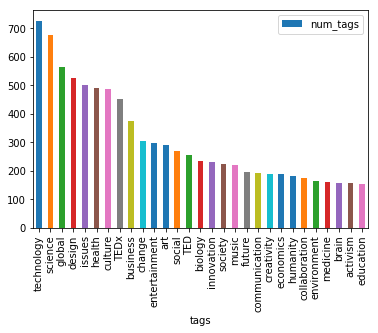

### Projektna naloga

Analiza podatkov - TED talks
======================
V projektni nalogi analiziran je [TED talks dataset](https://www.kaggle.com/rounakbanik/ted-talks/data). Skup podataka TED talks 
vsebuje podatke o videih zbranihih na strani TED.com v obdobju do 21. septembra 2017.

## Opis
TED je neprofitna organizacija posvečena širjenju idej. Začetek zgodbe sega v leto 1984, ko se je v Kaliforniji odvil štiridnevni 
dogodek namenjen združitvi zamisli s treh različnih področij: tehnologije, zabave in oblikovanja = Technology, Entertainment, Design. 
Od tedaj TED deluje preko raznolikih mednarodnih pobud in aktivnosti. Na vsakoletni TED konferenci vodilni svetovni misleci in akterji 
svoje znanje posredujejo v 3 do 18 minut dolgih nastopih. Po dogodku so na TED.com njihovi govori brezplačno dostopni vsakomur.

## Vsebina
Skup podatkov vsebuje dve CSV datoteki:
- ted_main.csv - Vsebuje podatke o TED talk govornikima in TED Talk metadata.
- transcripts.csv - Vsebuje prepis in URL povezavo do vsakeg TED videa.

## Analiza podatkov
- Uporabljene Python libraries:
  - numpy
  - pandas
  - matplotlib

### Opis podatkov
 **ted_main.csv**

Naziv|Opis|Tip podatka
---|---|---
comments|The number of first level comments made on the talk|Numeric
description|A blurb of what the talk is about|String
duration|The duration of the talk in seconds|Numeric
event|The TED/TEDx event where the talk took place|String
film_date|The Unix timestamp of the filming|Numeric
languages|The number of languages in which the talk is available|Numeric
main_speaker|The first named speaker of the talk|String
name|The official name of the TED Talk. Includes the title and the speaker|String
num_speaker|The number of speakers in the talk|Numeric
published_date|The Unix timestamp for the publication of the talk on TED.com|Numeric
ratings|A stringified dictionary of the various ratings given to the talk (inspiring, fascinating, jaw dropping, etc.)|String
related_talks|A list of dictionaries of recommended talks to watch next|String
speaker_occupation|The occupation of the main speaker|String
tags|The themes associated with the talk|String
title|The title of the talk|String
url|The URL of the talk|String
views|The number of views on the talk|Numeric

 **transcript.csv**
 
Naziv|Opis|Tip podatka
---|---|---
transcript|The official English transcript of the talk|String
url|The URL of the talk|String


## Glavna prašanja
- Kateri so najbolj najbolj oceneni videi? Ali so oni nekako povezani? Ali govorijo o istih temah?
- Ali obstaja povezava med ocenom in številom pogleda videa?
- Koje so najbolj pogoste teme govornikov?
- Koje teme provociraju največ komentarjev?
- Koliko so v povprečju dolgi govori, kateri so bolje oceneni, dolgi ali kratki?
- Ali obstaja povezava med dolžino in temo videa?
- V katerih mesecih je prikazovano največ videa? Gdaj so posnamljeni najbolj populrani videi?
- Ali so TED talk-i med saboj nekako povezani?
- Povezanost okupacije govornika z temo in ratingom pogovorja?

Sigurno je da videi koji so na snimani prije veliko leta bojo imeli več pogledov. Menim da najpogosteje komentirani videi bojo govorili o politiki in znanosti. Verjetno je da v zimskih mesecev videi bodo več pregledani. Verjujem da so videi povezani preko teme in govornika. A okupacija govornika verjetno bo povezana z temo govora.

## Ugotovitve

### Učitavanje podatkov

```
import pandas as pd
import numpy as np
%matplotlib inline
import matplotlib.pyplot as plt
import datetime
import time
```
```
cols = ['comments', 'description', 'duration', 'event', 'film_date', 'languages', 'main_speaker', 'name', 'num_speaker', 'published_date', 'ratings', 'related_talks', 'speaker_occupation', 'tags', 'title', 'url', 'views']
ted = pd.read_csv('data/ted_main.csv', sep=',', names=cols, skiprows=1, encoding='utf-8')

t_cols = ['transcript', 'url']
transcripts = pd.read_csv('data/transcripts.csv', sep=',',names=t_cols, skiprows=1, encoding='utf-8')
```
Timestamp datuma izdelave in objave videa pretvorimo v navadni datum:
```
ted['film_date'] = ted['film_date'].apply(lambda x: datetime.datetime.fromtimestamp(int(x)).strftime('%d-%m-%Y'))
ted['published_date'] = ted['published_date'].apply(lambda x: datetime.datetime.fromtimestamp(int(x)).strftime('%d-%m-%Y'))
ted['duration']=ted['duration'].div(60).round(2)
```

### Popularnost videa
```
max_views = ted[['title', 'main_speaker', 'views']].sort_values('views', ascending=False)[:10]
mean_views = ted['views'].mean()
max_comments = ted[['title', 'main_speaker', 'views', 'comments']].sort_values('comments', ascending=False)[:10]
```
1. **Do schools kill creativity?**
   - najbolj popularan TED talk, ima več kot 47 milijonov pogledov
   - najstarejši video, prvi uploadan na web stran (to vidimo iz originalnega dataseta ki je rasporejen po datumu objave na web strani 
   - posle videa **Militant atheism** je video z največ komentarov
   
   - Ken Robinson govori o tem kako je način učenja učencov v šoli zastarel, on to govori še leta 2006
   - kako je šola preveč usmerena v eni smeri, da vsi uče na isti način, z enakim uputstvima, bez mogočnosti nalaženja svjih rešitvi.
   
2. **Your body language may shape who you are**
   - drugi najbolj popularen video,ima več kot 43 milijonov pogledov
3.
   - to so edina 2 TED talka ki imajo več kot 40 milijonov pogledov
   - v povprečju videi so pregledani okol milijon in pol krat (1 698 297)


4. Najbolj pogoste **teme** govornikov
   - vsak video ima določene oznake (ang. Tags) oziroma o njegovoj vsebini
   - iz toga koliko je posamezan Tag pogost, vidimo koje teme se pogosto pojavljuju
   
